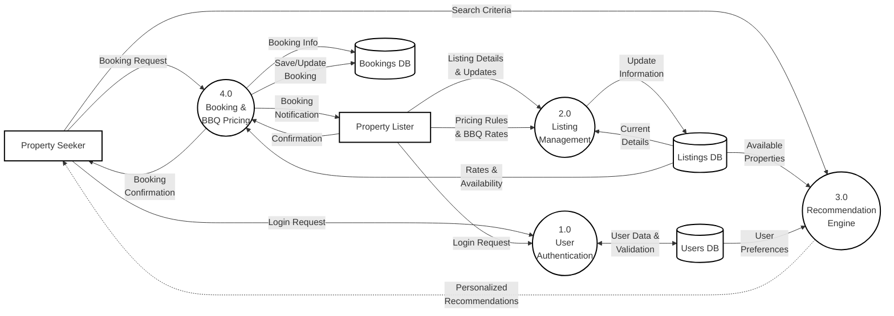

# Corrected Level 1 Data Flow Diagram (DFD)

This diagram includes the **Property Lister** entity as requested.

```mermaid
graph LR
    %% Entities
    Seeker[Property Seeker]
    Lister[Property Lister]

    %% Processes
    P1((1.0<br/>User<br/>Authentication))
    P2((2.0<br/>Listing<br/>Management))
    P3((3.0<br/>Recommendation<br/>Engine))
    P4((4.0<br/>Booking &<br/>BBQ Pricing))

    %% Data Stores
    DB_Users[("Users DB")]
    DB_Listings[("Listings DB")]
    DB_Bookings[("Bookings DB")]

    %% Flows from Seeker (Left Side)
    Seeker -->|Login Request| P1
    Seeker -->|Search Criteria| P3
    Seeker -->|Booking Request| P4
    P3 -.->|Personalized<br/>Recommendations| Seeker
    P4 -->|Booking<br/>Confirmation| Seeker

    %% Flows from Lister (Right Side - NEW)
    Lister -->|Login Request| P1
    Lister -->|Listing Details<br/>& Updates| P2
    Lister -->|Pricing Rules<br/>& BBQ Rates| P2
    Lister -->|Confirmation| P4
    P4 -->|Booking<br/>Notification| Lister

    %% Database Interactions
    P1 <-->|User Data &<br/>Validation| DB_Users
    
    P2 -->|Update<br/>Information| DB_Listings
    DB_Listings -->|Current<br/>Details| P2
    
    DB_Listings -->|Available<br/>Properties| P3
    DB_Users -->|User<br/>Preferences| P3
    
    P4 -->|Booking Info| DB_Bookings
    P4 -->|Save/Update<br/>Booking| DB_Bookings
    DB_Listings -->|Rates &<br/>Availability| P4

    %% Styling to match simplified DFD look
    classDef process fill:#fff,stroke:#000,stroke-width:2px;
    classDef store fill:#fff,stroke:#000,stroke-width:2px,shape:cylinder;
    classDef entity fill:#fff,stroke:#000,stroke-width:2px,shape:rect;
    
    class P1,P2,P3,P4 process;
    class DB_Users,DB_Listings,DB_Bookings store;
    class Seeker,Lister entity;
```
